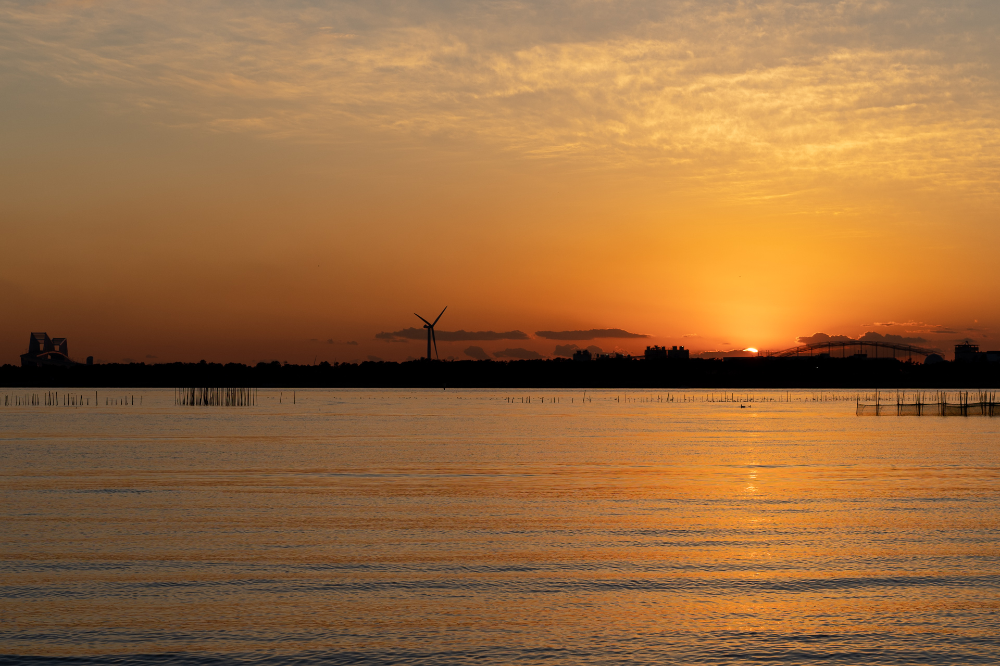
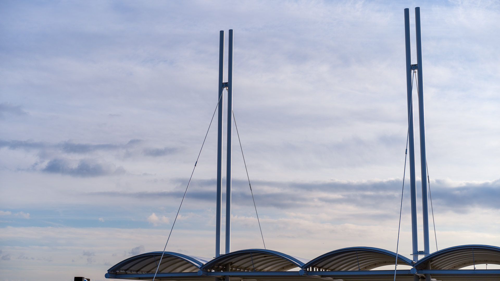
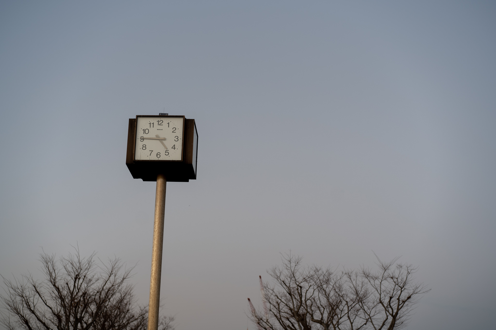
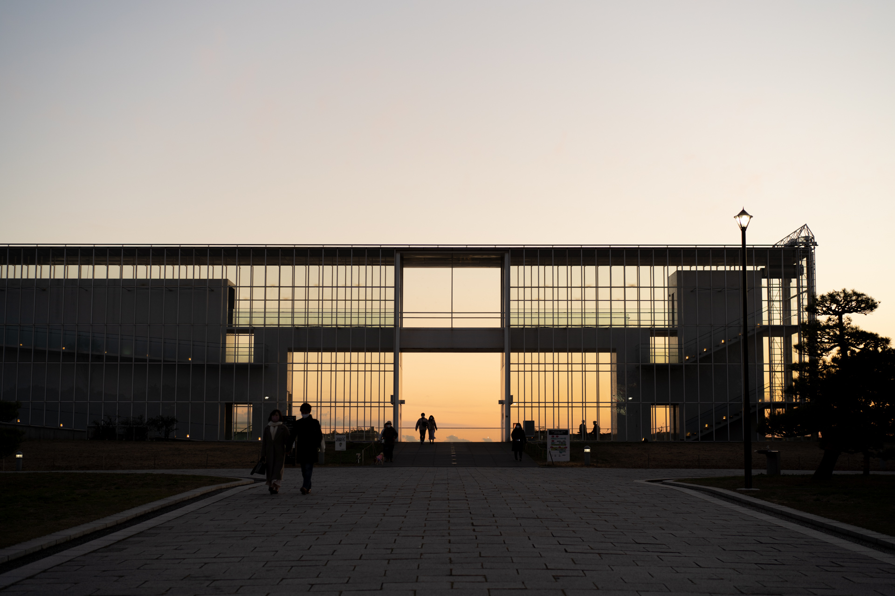

2020年のことは2020年のうちにふりかえろうと思って [Medium](https://cotton-ori.medium.com/) を開いたのですが、すでに日本市場から撤退している Medium プラットフォーム上に書くのもどうかと気になったあげく、自分でブログを作り始めてしまいました。そんなことをだらだら休みながらやっていたので当然ながら、2020年のうちには振り返れませんでした。あけましておめでとうございます。

2020年は全然うまくいかない年だったなと感じています。あれだけずっと見ていた Twitter についても、昔からネガティブなツイートをしないようにしていたのだけど、そうしたらいまでは開くこともほとんどなくなってしまいました。

仕事について。これまではわりとシンプルというか、あえて大げさにいえば "直接ユーザー価値にならない時間の使い方はしない" というような感じだったのだけれど、それは視野が狭かったよなぁと。とくに市場も大きいのならなおさらやることも多いので、持続可能なやり方で生産性を維持して少しずつやっていかないとやりたいことをやりきる前につぶれてしまうなとおもいました。組織課題だったり、メンタル問題だったり、メンバーとの対話だったりの重要性が増しました。

その過程で、開発者であることをやめた。今はコードは書いていなくて、プロダクトオーナーとして仕事をしています。ビジネススキルが全然なく素人同然というか普通に素人なので、毎日なにもできないなぁと思いながらなんとか目の前のことをやっています。ブログを自作したのもそのリハビリのつもり。公開するにあたって、普段 Google Cloud Platform のクラウドサーバーなので久しぶりに Amazon Web Services でも使ってホスティングしようとしたら用語や設定項目を全部忘れていました。でも、ソフトウェア開発はかけた時間に比例してよくなるからすごく精神的に楽ですね。

余暇時間の使い方も変わりました。これまでは直接仕事の役に立ちそうな情報しかほとんどとっていなかったのが、それ以外の関係なさそうなことも調べたり見に行ったりするようになっていきました。たぶん、一見なにと結びつくのかわからないものに時間をかけることに対する不安がありました。総合してみると、短期的な結果を求めて焦っていたなと。昔はしなかったようなことをするようになりました。本を多く読み、散歩にでかけては写真を撮るようになりました。

人との向き合い方も変わり、他人に感謝することが増えました。

パートナーがいなくなったので時間が増えました。

#### しなやかに優しく

2021年はしなやかに生きます。

<iframe width="560" height="315" src="https://www.youtube.com/embed/kTa1uR0tgAM" frameborder="0" allow="accelerometer; autoplay; clipboard-write; encrypted-media; gyroscope; picture-in-picture" allowfullscreen></iframe>
